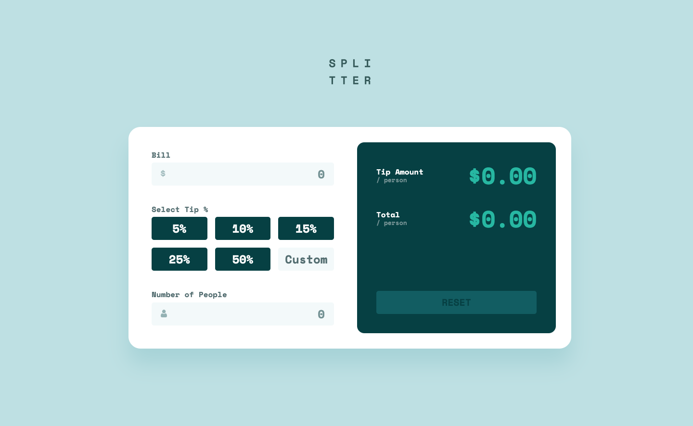

# Frontend Mentor - Tip calculator app solution

This is a solution to the [Tip calculator app challenge on Frontend Mentor](https://www.frontendmentor.io/challenges/tip-calculator-app-ugJNGbJUX). Frontend Mentor challenges help you improve your coding skills by building realistic projects.

## Table of contents

- [Overview](#overview)
  - [The challenge](#the-challenge)
  - [Screenshot](#screenshot)
  - [Links](#links)
- [My process](#my-process)
  - [Built with](#built-with)
  - [What I learned](#what-i-learned)
  - [Continued development](#continued-development)
- [Author](#author)

## Overview

### The challenge

Users should be able to:

- View the optimal layout for the app depending on their device's screen size
- See hover states for all interactive elements on the page
- Calculate the correct tip and total cost of the bill per person

### Screenshot



### Links

- Solution URL: [Add solution URL here](https://your-solution-url.com)
- Live Site URL: [Here](https://nv-tip-calculator-app.netlify.app/)

## My process

### Built with

- Semantic HTML5 markup
- SASS/SCSS
- Flexbox
- CSS Grid
- Mobile-first workflow
- JavaScript

### What I learned

In this challenge I learned how to customize radio buttons to fit the design criteria. This was something new to me and I am proud of how it turned out.

```html
<label>
	<input type="radio" name="tipAmount" value="0.05" /><span>5%</span>
</label>
```

```css
label:not(:last-child) {
	position: relative;
	background-color: var(--radio-default-bg-color);
	border-radius: 5px;

	input[type='radio'] {
		height: 100%;
		width: 100%;
		border-radius: 5px;
		appearance: none;

		&:not(:disabled):checked {
			background-color: var(--radio-checked-color);
			background-clip: content-box;
		}
	}

	span {
		position: absolute;
		top: 50%;
		left: 50%;
		transform: translate(-50%, -50%);
		font-size: var(--fs-input-24);
		color: var(--clr-neutral-white);
	}

	&:hover,
	input:hover {
		background-color: var(--clr-neutral-seafoam);

		> span {
			color: var(--clr-neutral-cyanDark);
		}
	}

	&:has(:checked) {
		span {
			color: var(--clr-neutral-cyanDark);
		}
	}
}
```

### Continued development

I am excited to continue to learn new 'to me' styling and JS methods, practices, tips, & concepts.

## Author

- Portfolio - [Nate Valline](https://natevalline.dev)
- Frontend Mentor - [@nvalline](https://www.frontendmentor.io/profile/nvalline)
- LinkedIn - [Nate Valline](https://www.linkedin.com/in/nvalline)
